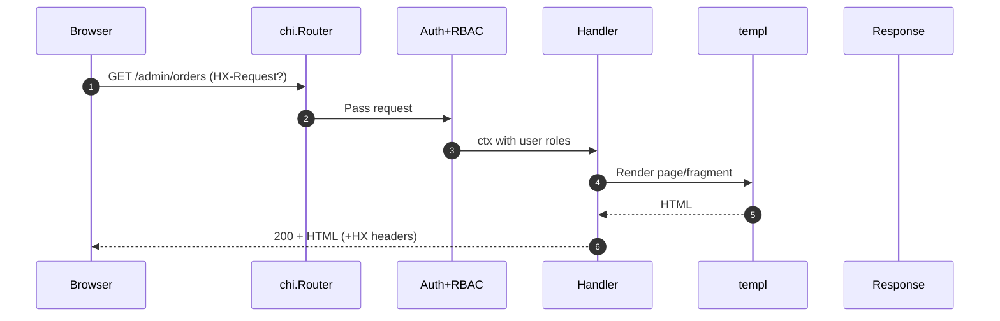

# Admin Console UI Architecture

## Overview

The admin console renders primarily on the server with Go + `templ` templates, using `htmx` for progressive enhancement and partial swaps. Routing is handled by `chi`, with convention-based separation between full-page handlers and fragment endpoints. TailwindCSS provides the design system, compiled into static assets that the Go server serves via versioned paths.

## Stack Decisions

- **Router**: [`chi`](https://github.com/go-chi/chi) for lightweight middleware, context support, and nested routing that matches the admin IA.
- **Templates**: [`templ`](https://templ.guide/) compiled templates grouped by feature area, with shared layouts and component partials.
- **Partial Updates**: `htmx` drives incremental UX (filters, modals, D&D) without SPA overhead; handlers return HTML fragments matching the `hx-target`.
- **Assets**: Tailwind compiled with the standalone Tailwind CLI (no Node runtime) invoked via Make targets. Generated CSS is served from `/public/static/`. Optional Alpine.js (or similar) can ship as additional static files.
- **State**: Server remains source of truth; client-side state limited to transient UI (modal toggles, D&D). Persistent selections captured via form submission.

## Routing & Naming Conventions

### Packages

- `internal/admin/http`: HTTP router setup, middleware, and handler wiring.
- `internal/admin/handlers/<feature>`: Feature-specific handlers returning templ components.
- `internal/admin/templates/<feature>`: templ files compiled into Go code.

### Route Registration

```go
r.Route("/admin", func(r chi.Router) {
    r.Use(auth.RequireFirebaseAdmin, middleware.Timeout(time.Second*15))

    r.Get("/", dashboard.IndexPage)
    r.Get("/orders", orders.IndexPage)
    r.Get("/orders/table", orders.TableFragment)
    r.Get("/orders/{orderID}", orders.DetailPage)
    r.Get("/orders/{orderID}/tab/{tab}", orders.DetailTabFragment)
    r.Post("/orders/{orderID}/modal/status", orders.StatusModal)
    r.Put("/orders/{orderID}:status", orders.UpdateStatus)
})
```

- Base path is configurable via the `ADMIN_BASE_PATH` environment variable (defaults to `/admin`).
- **Full pages**: `GET /admin/...` returning complete HTML with `<html>` wrapper.
- **Fragments**: `GET /admin/.../table`, `/modal/...`, `/fragment/...` returning partial HTML (no `<html>`). Handlers live alongside page handlers with `...Fragment` suffix.
- **Mutations**: `POST/PUT/DELETE` endpoints return either JSON (for `hx-request` expecting JSON) or HTML partial on success when a UI region must update.
- **Search / global utilities**: plural nouns (`/admin/orders`) for lists, singular resource tabs under `/admin/orders/{id}/tab/<tabName>`.
- **Modal endpoints**: `GET` to render modal body (prefixed with `/modal/`), `hx-target` is modal container, `hx-trigger="click"`.

## Template Structure

```
internal/admin/templates/
  layouts/
    base.templ        # wraps `<html>`, navigation, flash area
    modal.templ       # modal shell
  components/
    components.templ  # atomic UI elements (button, card, table, text)
  partials/
    nav.templ         # sidebar
    breadcrumbs.templ # page breadcrumbs
  helpers/
    format.go         # currency/date/i18n helpers + component helpers
  dashboard/
    index.templ
    data.go           # view-specific helper functions
```

- Layouts render once per full page. Fragments render only the inner markup to be swapped.
- Shared components expose templ functions (`components.Table(...)`) to keep markup consistent.
- Keep fragment outputs narrow: wrap top-level element in container with predictable IDs (`id="orders-tbody"`).

## Handler Patterns

```go
func IndexPage(w http.ResponseWriter, r *http.Request) error {
    vm := orders.ViewModel{
        Filters: parseFilters(r),
        Table:   fetchTable(r.Context()),
    }
    return templ.Render(r.Context(), w, orders.Index(vm))
}

func TableFragment(w http.ResponseWriter, r *http.Request) error {
    rows := fetchTable(r.Context())
    return templ.RenderFragment(r.Context(), w, orders.Table(rows)) // helper wraps templ.Execute
}
```

- Use `templ.RenderFragment` helper to skip HTML shell for fragments.
- Parse filters via dedicated helper; avoid reading form data in templates.
- Return typed errors; middleware translates to `HX-Trigger: showError` or standard error page based on request headers.

## htmx Interaction Guidelines

- **Targets**: Fragment endpoints return markup aligned with specific IDs (`hx-target="#orders-tbody"`).
- **Swaps**: Prefer `hx-swap="outerHTML"` when replacing entire fragment containers.
- **Indicators**: Attach `hx-indicator` to show spinners; shared component `components.Spinner`.
- **Errors**: Middleware detects `HX-Request` header. On error, set `HX-Retarget` to `#toast-area` and render toast fragment.
- **CSRF**: All mutating forms include hidden token inserted via `templ` helper (`csrf.HiddenInput(r)`).
- **Caching**: Use `hx-vals` for lightweight payloads (e.g., D&D updates in production board).

## Asset Pipeline

1. Tailwind source lives under `admin/web/styles/tailwind.css`.
2. `make css` (or `make dev`) runs the standalone Tailwind binary to emit `public/static/app.css` (hashed filenames can be added later by the build).
3. Go embeds generated assets via `embed.FS` or serves from disk in dev.
4. Layout components link to `/public/static/app.css`; helper wrappers can evolve once fingerprinting is introduced.
5. JavaScript enhancements (e.g., Alpine.js) can ship as additional files in `public/static` built via separate scripts.

## Middleware Stack

- `RequestID`, `RealIP`, `Logger`, `Recoverer`, `Timeout` from chi.
- Custom middleware per admin routes:
  - `HTMX()` annotates HX headers and exposes `middleware.IsHTMXRequest(ctx)` for handlers.
  - `NoStore()` sets `Cache-Control: no-store` for authenticated pages.
  - `Auth()` validates Firebase (placeholder) bearer tokens, injects `middleware.User`, and redirects unauthenticated browsers to `ADMIN_BASE_PATH + "/login"` while returning 401 + `HX-Redirect` for htmx requests.
  - `CSRF()` issues double-submit cookies (`admin_csrf` by default) and enforces `X-CSRF-Token` on unsafe verbs; use `middleware.CSRFTokenFromContext(ctx)` to embed tokens into forms/meta tags.
- Fragment endpoints should be registered via `httpserver.RegisterFragment(r, "/path", handler)` to ensure they are htmx-only.

## Request Flow



## Coding Standards

- **Naming**: Match handler & template names (`orders.IndexPage`, `orders.Index`). Fragment handlers end with `Fragment`.
- **Context Keys**: Use typed keys (`type ctxKey string`) and avoid storing large structs.
- **Middleware**: Compose `RequestID`, `RealIP`, `Logger`, `Recoverer`, `Timeout`, `RBAC`. Apply Firebase token validation before admin routes.
- **Logging**: Structured logging via `slog` with request ID injected; fragment requests logged at `DEBUG` unless error occurs.
- **Testing**: Handler tests use `httptest` with golden HTML fixtures. Fragments validated with DOM diff (e.g., `gohtml`).
- **Accessibility**: Templates include ARIA attributes; ensure `hx` interactions degrade gracefully (links submit forms via `button type="submit"` fallback).

## Next Steps

- Create scaffolding generators (`cmd/adminctl`) to bootstrap new feature modules with routes, handlers, templates, tests.
- Establish lint CI to ensure fragment handlers avoid emitting `<html>` wrapper.
