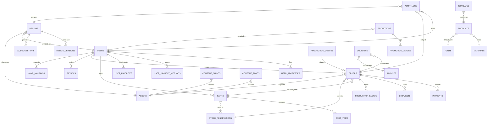

# API Data Models

This package is the canonical reference for Firestore collections, document schemas, storage structure, and ID conventions backing the API v1 surface described in `doc/api/api_design.md`.

- `firestore.collections.yaml` — collection inventory with schema pointers, composite indexes, TTLs.
- `external-ids.yaml` — prefixes and generators for public- and internal-facing identifiers.
- `storage-layout.md` — GCS bucket layout, retention, IAM, and encryption notes.
- `data-protection.md` — data classification, masking, and logging redaction policy.
- `*.schema.yaml` — JSON Schema documents (YAML bindings) sourced from `doc/db/schema`.

> Diagram shows logical relationships; see `firestore.collections.yaml` for cardinality and field-level references.
